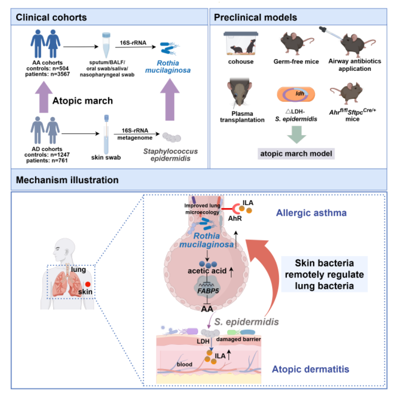

# SMRAM
This repository contains custom computer codes for main analyses in manuscript 'Skin commensal bacteria regulate lung microbiota to alleviate allergic asthma'.

## Abstract
When the ancestors of humans ventured onto land hundreds of millions of years ago, exposure to air simultaneously altered the host's lung and skin microbiota. Evolution shaped the cross-organ tolerance of host immune system to commensals, which in turn regulate excessive immune responses in the host. Through multi-center cohort studies and mouse models, we demonstrated that in atopic dermatitis, skin commensal Staphylococcus epidermidis (S. epidermidis) produces indole-3-lactic acid (ILA) to activate aryl hydrocarbon receptor (AhR) in the lung via systemic circulation. This activation dependently increases lung commensal Rothia mucilaginosa (R. mucilaginosa) abundance, elevating short-chain fatty acids (SCFAs) concentration in the lung environment to alleviate atopic march (the progression from atopic dermatitis to allergic asthma). These findings identify a conserved cross-organ microbial adaptive evolution strategy against excessive host immunity, offering clues for therapies targeting inter-organ bacterial crosstalk in immune regulation.

## 🎨 Graphical Abstract

## 🧰 Code
- `code/seurat_utils.R` + `code/cellchat_utils.R`: streamlined Seurat and CellChat workflows.
- `code/microbiome_utils.R` + `code/microbiome_prediction_utils.R`: microbiome stats, ordination, and prediction helpers.
- `code/enrichment_utils.R` + `code/kegg_utils.R` + `code/limma_utils.R`: differential testing and KEGG/GSEA enrichment.
- `code/metabolism_utils.R` + `code/heatmap_utils.R` + `code/plot_utils.R` + `code/theme_utils.R`: metabolite cleanup plus ready-made plots, heatmaps, and themes.
- `code/multiomics_utils.R` + `code/lefse_utils.R` + `code/iobr_utils.R` + `code/tempdir_utils.R`: multi-omics merging, LEfSe wrappers, signature scoring, and fixed temp directories.

## 📂 Data Availability
- Single-cell RNA-seq transcriptomics: GEO GSE310069.
- 16S rRNA gene sequences: ENA PRJEB103845.

## 📖 Citation
Skin commensal bacteria regulate lung microbiota to alleviate allergic asthma; Under Review, 2026

## 📧 Lead Contact
Gaofeng Wang (gwang45@jhmi.edu)
