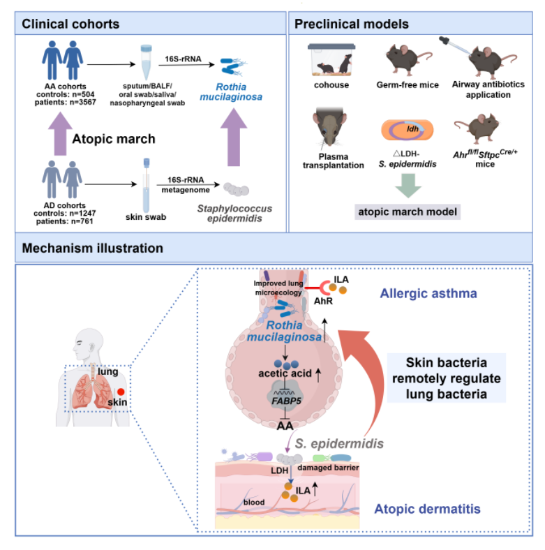

# SMRAM
This repository contains custom computer codes for main analyses in manuscript 'Skin commensal bacteria regulate lung microbiota to alleviate allergic asthma'.

## Abstract
When the ancestors of humans ventured onto land hundreds of millions of years ago, exposure to air simultaneously altered the host's lung and skin microbiota. Evolution shaped the cross-organ tolerance of host immune system to commensals, which in turn regulate excessive immune responses in the host. Through multi-center cohort studies and mouse models, we demonstrated that in atopic dermatitis, skin commensal Staphylococcus epidermidis (S. epidermidis) produces indole-3-lactic acid (ILA) to activate aryl hydrocarbon receptor (AhR) in the lung via systemic circulation. This activation dependently increases lung commensal Rothia mucilaginosa (R. mucilaginosa) abundance, elevating short-chain fatty acids (SCFAs) concentration in the lung environment to alleviate atopic march (the progression from atopic dermatitis to allergic asthma). These findings identify a conserved cross-organ microbial adaptive evolution strategy against excessive host immunity, offering clues for therapies targeting inter-organ bacterial crosstalk in immune regulation.

## 🎨 Graphical Abstract

## 🧰 Code
- `code/01_stacked_bar_plot.R`: stacked bar plots for microbiome composition summaries.
- `code/02_bar_plot.R`: bar plots with error bars for grouped quantitative comparisons.
- `code/03_boxplot.R`: boxplots with overlaid sample points for distribution-level comparisons.
- `code/04_beta_diversity_scatter_plot.R`: beta diversity scatter plots with group ellipses.
- `code/05_heatmap.R`: heatmaps for feature-level abundance or score matrices.
- `code/06_single_cell_tsne_umap.R`: tSNE or UMAP plots for single-cell cluster visualization.
- `code/07_single_cell_feature_plot.R`: feature expression plots for selected marker genes.
- `code/08_single_cell_violin_plot.R`: violin plots for marker expression across cell groups.
- `code/09_single_cell_dot_plot.R`: dot plots for marker panels across annotated cell groups.

## 📂 Data Availability
- Single-cell RNA-seq transcriptomics: GEO GSE310069.
- 16S rRNA gene sequences: NCBI PRJNA1345678.

## 📖 Citation
Skin commensal bacteria regulate lung microbiota to alleviate allergic asthma; Under Review, 2026

## 📧 Lead Contact
Gaofeng Wang (gwang45@jhmi.edu)
